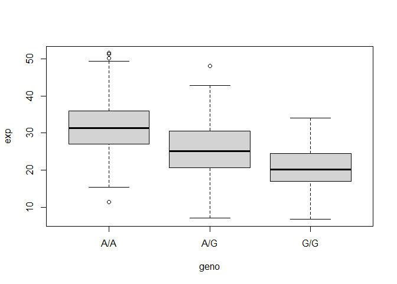
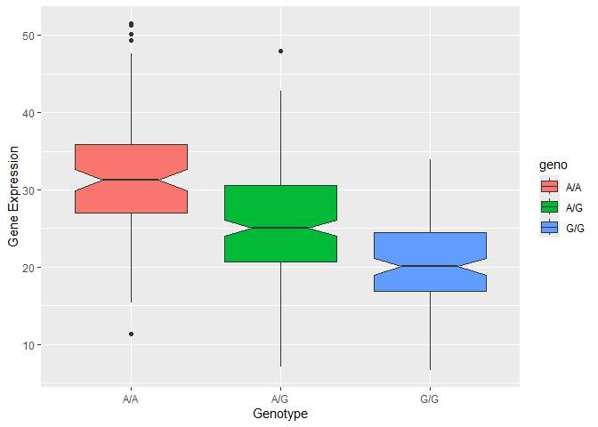

# Class 12: Genome Informatics
Hyejeong Choi (PID: A16837133)

- [Section 1: : Identify genetic variants of
  interest](#section-1--identify-genetic-variants-of-interest)
- [Section 4: Population Scale
  Analysis](#section-4-population-scale-analysis)

# Section 1: : Identify genetic variants of interest

Downloaded CSV file from Ensemble
https://useast.ensembl.org/Homo_sapiens/Variation/Sample?db=core;r=17:39894595-39895595;v=rs8067378;vdb=variation;vf=959672880#373531_tablePanel

Here we read this CSV file

``` r
mxl <- read.csv("373531-SampleGenotypes-Homo_sapiens_Variation_Sample_rs8067378.csv")

head(mxl)
```

      Sample..Male.Female.Unknown. Genotype..forward.strand. Population.s. Father
    1                  NA19648 (F)                       A|A ALL, AMR, MXL      -
    2                  NA19649 (M)                       G|G ALL, AMR, MXL      -
    3                  NA19651 (F)                       A|A ALL, AMR, MXL      -
    4                  NA19652 (M)                       G|G ALL, AMR, MXL      -
    5                  NA19654 (F)                       G|G ALL, AMR, MXL      -
    6                  NA19655 (M)                       A|G ALL, AMR, MXL      -
      Mother
    1      -
    2      -
    3      -
    4      -
    5      -
    6      -

``` r
table(mxl$Genotype..forward.strand.)
```


    A|A A|G G|A G|G 
     22  21  12   9 

Find the percentage/proportion for each genotype

``` r
round(table(mxl$Genotype..forward.strand.) / nrow(mxl) * 100, 2)
```


      A|A   A|G   G|A   G|G 
    34.38 32.81 18.75 14.06 

Now let’s look at a different population. I picked the GBR.

``` r
gbr <- read.csv("373522-SampleGenotypes-Homo_sapiens_Variation_Sample_rs8067378.csv")

head(gbr)
```

      Sample..Male.Female.Unknown. Genotype..forward.strand. Population.s. Father
    1                  HG00096 (M)                       A|A ALL, EUR, GBR      -
    2                  HG00097 (F)                       G|A ALL, EUR, GBR      -
    3                  HG00099 (F)                       G|G ALL, EUR, GBR      -
    4                  HG00100 (F)                       A|A ALL, EUR, GBR      -
    5                  HG00101 (M)                       A|A ALL, EUR, GBR      -
    6                  HG00102 (F)                       A|A ALL, EUR, GBR      -
      Mother
    1      -
    2      -
    3      -
    4      -
    5      -
    6      -

Find the proportion of G\|G

``` r
round(table(gbr$Genotype..forward.strand.) / nrow(gbr) *100, 2)
```


      A|A   A|G   G|A   G|G 
    25.27 18.68 26.37 29.67 

This variant that is associated with childhood asthma is more frequent
in the GBR population than the MXL population.

Let’s now dig into this further.

# Section 4: Population Scale Analysis

One sample is obviously not enough to know what is happening in a
population. You are interested in assessing genetic differences on a
population scale. So, you processed about ~230 samples and did the
normalization on a genome level. Now, you want to find whether there is
any association of the 4 asthma-associated SNPs (rs8067378…) on ORMDL3
expression.

> Q13: Read this file into R and determine the sample size for each
> genotype and their corresponding median expression levels for each of
> these genotypes.

``` r
expr <- read.table("rs8067378_ENSG00000172057.6.txt")

head(expr)
```

       sample geno      exp
    1 HG00367  A/G 28.96038
    2 NA20768  A/G 20.24449
    3 HG00361  A/A 31.32628
    4 HG00135  A/A 34.11169
    5 NA18870  G/G 18.25141
    6 NA11993  A/A 32.89721

``` r
nrow(expr)
```

    [1] 462

There are 462 samples total.

The sample sizes of each genotype:

``` r
table(expr$geno)
```


    A/A A/G G/G 
    108 233 121 

The median expression for each genotype:

``` r
expr_boxplot <- boxplot(exp ~ geno, expr)
```



``` r
round(expr_boxplot$stats, 2)
```

          [,1]  [,2]  [,3]
    [1,] 15.43  7.08  6.67
    [2,] 26.95 20.63 16.90
    [3,] 31.25 25.06 20.07
    [4,] 35.96 30.55 24.46
    [5,] 49.40 42.76 33.96

The median for the A\|A genotype is 31.25. The median for the A\|G
genotype is 25.06. The median for the G\|G genotype is 20.07.

> Q14: Generate a boxplot with a box per genotype, what could you infer
> from the relative expression value between A/A and G/G displayed in
> this plot? Does the SNP effect the expression of ORMDL3?

``` r
library(ggplot2)

ggplot(expr) +
  aes(x=geno, y=exp, fill=geno) +
  labs(x="Genotype", y="Gene Expression") +
  geom_boxplot(notch=TRUE)
```



The gene expression is higher on average with the A\|A genotype than the
G\|G genotype. Yes, the SNP effects the expression of the ORMDL3 gene.
Having a A\|G genotype slightly increases the expression and the A\|A
genotype significantly increases the expression of the ORMDL3 gene. This
shows that a SNP with the “G” allele decreases the gene expression.
